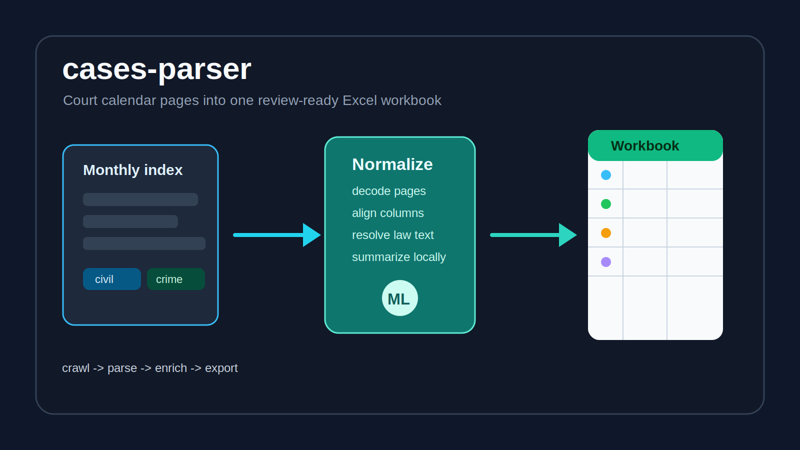

# cases-parser



`cases-parser` turns Latvian court-calendar pages into one clean Excel workbook. It follows monthly hearing indexes, normalizes civil, criminal, and administrative rows, and enriches criminal matters with cited law text plus a short local summary.

## What It Does

- Crawls a monthly court-calendar index and follows each populated process link.
- Reads civil, criminal, administrative, and administrative-offence hearing pages.
- Decodes legacy `windows-1257` court pages safely into structured rows.
- Produces one workbook with shared fields and process-specific enrichment.
- Resolves criminal-law citations against the configured law-source registry.
- Uses a local summarizer helper when richer criminal-row summaries are available.

## Highlights

- **One schema for messy source pages:** different process pages land in a consistent workbook layout.
- **Traceable enrichment:** output keeps source URLs and visible fallback text when citations cannot be resolved exactly.
- **Local-first summaries:** criminal summaries can run locally, with deterministic fallback behavior when model output is weak.
- **Practical Excel output:** the workbook is designed for filtering, sorting, and review rather than raw scraping dumps.

## Quick Start

```bash
npm install
node scripts/merge-kriminalprocess.mjs '<monthly-index-url>' [output-path]
```

Optional local summary support:

```bash
python3 -m pip install "mlx-lm>=0.30.7"
```

Default output:

```text
court-calendar-<index-name>.xlsx
```

## Project Map

| Path | Purpose |
| --- | --- |
| `scripts/merge-kriminalprocess.mjs` | Main crawler, parser, normalizer, and workbook writer |
| `scripts/mlx_summarize.py` | Local helper for criminal-row case summaries |
| `data/law-sources.json` | Law-code registry used during citation resolution |
| `run-kriminalprocess.sh` | Convenience wrapper for the current month |

## Output Shape

The workbook includes hearing date and time, city, court, process group, party fields, case number fields, case subject, source URL, criminal-law citation text, summary, and seriousness rank fields. Criminal-only enrichment is filled only when the row belongs to a criminal process.

## Testing

This public copy keeps the runnable parser and helper scripts. A practical smoke check is:

```bash
npm install
node scripts/merge-kriminalprocess.mjs '<monthly-index-url>' /tmp/court-calendar-smoke.xlsx
```

Review the workbook for populated shared columns, criminal enrichment columns, and source links.

## Notes

Some legal citations may not resolve to exact official text. When that happens, the output keeps a visible placeholder instead of silently inventing a match.

